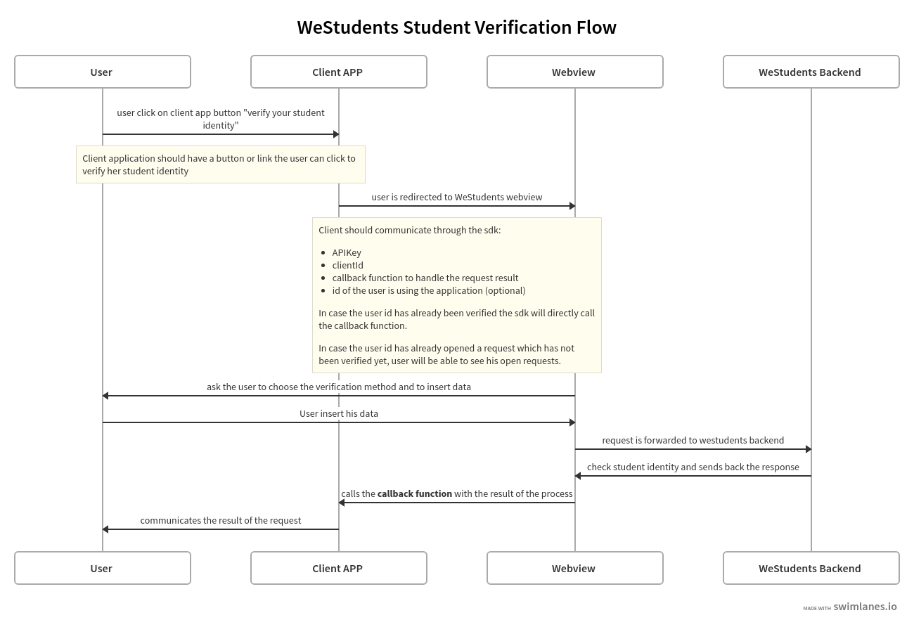

# Student Verification SDK

## Table of Contents
1. [Overview](#overview)
2. [Getting Started](#getting-started)
    1. [Import the library](#import-the-library-2)
    2. [Initialize the SDK](#initialize-the-sdk-2)
    3. [Params](#params-2)
3. [Step by step guide](#step-by-step-guide)
    1. [Import the library](#import-the-library-3)
    2. [Add content to page](#add-content-to-page-3)
    3. [Initialize the SDK](#initialize-the-sdk-3)
    3. [Handling callback](#handling-callback-3)

## Overview

The WeStudents Student Verification SDK allows to verify student identity through four different methods:
1. Login with WeStudents 
2. Login with electronic register (ARGO, AXIOS, NUVOLA, CLASSEVIVA, MASTERCOM)
3. Upload of identity documents (async)
4. School email verification (async)

The following schema describe the process for student verification:

.


> **WARNING**
> For asynchronous processes (3 and 4) the final result of the request will be sent to client through the webhook endpoint inserted in enrollment phase.

## Getting Started

### Import the library
You can include the library as a regular script tag on your page:
```html
<script src="https://storage.googleapis.com/westudents-public/scripts/verify-sdk.js"></script>
```

### Initialize the SDK
```javascript
StudentVerificationSDK.init({
    apiKey: 'YOUR-API-KEY',
    userExternalId: 'USER-ID',
    onCompleted: ({ userId, verified, status }) => {
       // handle verification response here 
    },
    options: {
        // optional configs
        wsLoginEnabled: true,
        electronicRegisterEnabled: false
    }
})
```

### Params
#### `apiKey: string` required
Your personal api key. If you do not yet have one, [visit this page](https://ws-developers-docs.netlify.app/docs/getstarted).
#### `userExternalId: string` (optional)
You can pass an ID to link verification requests to the user. If you do not pass an ID, it will be automatically generated.
#### `onCompleted: function` (optional)
A callback function triggered after verification flow ends.

Params:
- `userId: string`: The user identifier specified or autogenerated.
- `verified: boolean`: Boolean value for verification status.
- `status: string`: Status of the latest request done. Could be `PENDING`, `REJECTED` or `VERIFIED`.

Possible values:

| METHOD              | verified              | status                 |
|---------------------|-----------------------|------------------------|
| Email               | `false`               | `PENDING`, `REJECTED`  |
| Documents           | `false`               | `PENDING`, `REJECTED`  |
| Electronic Register | `true`, `false`       | `VERIFIED`, `REJECTED` |
| Login with WS       | `true`, `false`       | `VERIFIED`, `REJECTED` |

#### `options` (optional)

Configuration options:
- `wsLoginEnabled: boolean`: Enable verification through the login with WeStudents app. Default: `true`.
- `electronicRegisterEnabled: boolean`: Enable verification through electronic registers APIs. Default: `true`.

## Step by step guide

### Import the library
Include the library as a regular script tag on your page:
```diff
<html>
    <head>
+       <script src="https://storage.googleapis.com/westudents-public/scripts/verify-sdk.js"></script>
    </head>
    <body>
        ...
    </body>
</html>
```

### Add content to page

```diff
<html>
    <head>
        <script src="https://storage.googleapis.com/westudents-public/scripts/verify-sdk.js"></script>
    </head>
    <body>
+       <div>
+           <div>
+               <h2>VERIFY STUDENT IDENTITY</h2>
+               <div>
+                   <p id="user">User ID: </p>
+                   <p id="result"></p>
+               </div>
+           </div>
+       </div>
    </body>
</html>
```

### Initialize the SDK

You can now initialize the SDK, with the `apiKey` ([click here](https://ws-developers-docs.netlify.app/docs/getstarted) to require one) and an `userExternalId`. You can also disable **Login with WeStudents ap*p* and **Login with electronic register** methods. 

```diff
<html>
    <head>
        <script src="https://storage.googleapis.com/westudents-public/scripts/verify-sdk.js"></script>
    </head>
    <body>
+       <script>
+           function verify() {
+               StudentVerificationSDK.init({
+                   apiKey: 'YOUR-API-KEY',
+                   userExternalId: 'USER-ID',
+                   options: {
+                       // optional configs
+                       wsLoginEnabled: true,
+                       electronicRegisterEnabled: false
+                   }
+               }) 
+           }
+       </script>
        <div>
            <div>
                <h2>VERIFY STUDENT IDENTITY</h2>
                <div>
                    <p id="user">User ID: </p>
                    <p id="result"></p>
                </div>
            </div>
+           <button onClick="verify()">Verify</button>
        </div>
    </body>
</html>
```

### Handling callback

To handle verification response, you have to define `onCompleted` callback function, it will be execute after verification flow ends and returns:
- `userId`: The user identifier specified or autogenerated.
- `verified`: Boolean value for verification status.
- `status`: Status of the latest request done.

```diff
<html>
    <head>
        <script src="https://storage.googleapis.com/westudents-public/scripts/verify-sdk.js"></script>
    </head>
    <body>
        <script>
            function verify() {
                StudentVerificationSDK.init({
                    apiKey: 'YOUR-API-KEY',
                    userExternalId: 'USER-ID',
                    options: {
                        // optional configs
                        wsLoginEnabled: true,
                        electronicRegisterEnabled: false
                    }
+                   onCompleted: ({ userId, verified, status }) => {
+                       document.getElementById('user').innerHTML = `User ID: ${userId}`
+                       if (verified) {
+                           document.getElementById('result').style.color = "green"
+                           document.getElementById('result').innerHTML = `VERIFICATO CON SUCCESSO`
+                       } else {
+                           if (status == 'PENDING') {
+                               document.getElementById('result').style.color = "#eb9c00"
+                               document.getElementById('result').innerHTML = `VERIFICA IN CORSO`
+                           } else if (status == 'REJECTED') {
+                               document.getElementById('result').style.color = "red"
+                               document.getElementById('result').innerHTML = `VERIFICA FALLITA`
+                           }
+                       }
+                   }
                }) 
            }
        </script>
        <div>
            <div>
                <h2>VERIFY STUDENT IDENTITY</h2>
                <div>
                    <p id="user">User ID: </p>
                    <p id="result"></p>
                </div>
            </div>
            <button onClick="verify()">Verify</button>
        </div>
    </body>
</html>
```

## Organizations and projects using this component

|                                                                                                                                                                                                                                            |                                                                                                                                                                                                                                                |
| ------------------------------------------------------------------------------------------------------------------------------------------------------------------------------------------------------------------------------------------ | ---------------------------------------------------------------------------------------------------------------------------------------------------------------------------------------------------------------------------------------------- |
| [<br/><sub><p align="center">Westudents.it</p></sub>](https://westudents.it/) |
